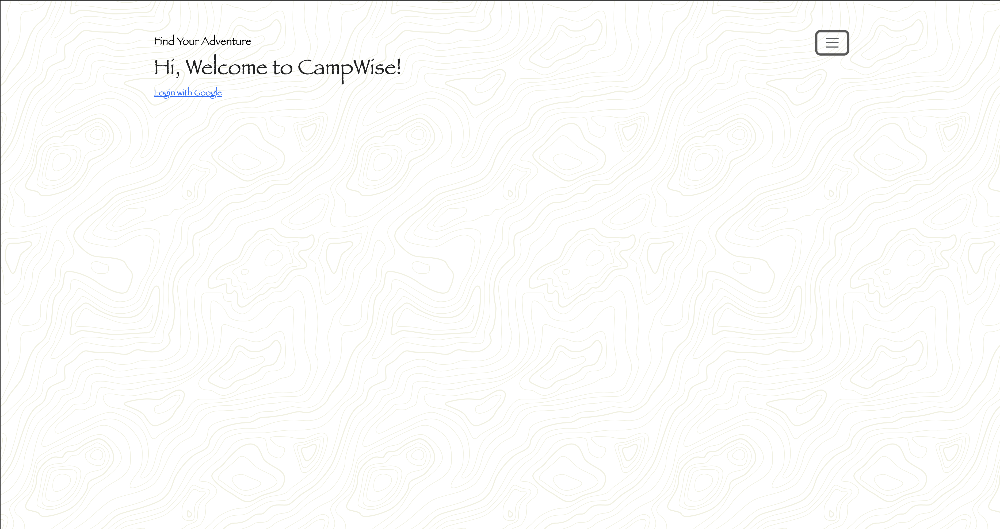
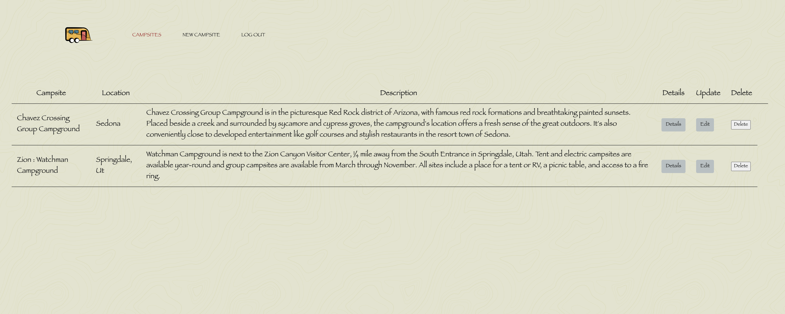
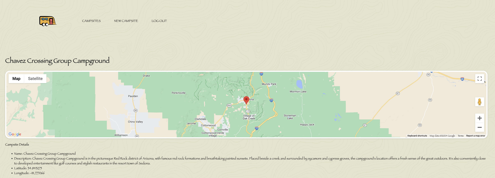

## CampWise App 🏕️
CampWise is a full CRUD (Create, Read, Update, Delete) application designed for campers and van life enthusiasts who want to share their favorite campsites with the community. Whether you're a seasoned camper or new to the lifestyle, CampWise provides a platform for discovering and sharing campsites that are not only enjoyable but also budget-friendly, as the emphasis is on free camping locations.

## Screenshots of Application

## Technologies Used 
- JavaScript
- OAuth 
- HTML
- CSS

## Getting Started 
Click [here](https://campsite-app-1f55c47c44e7.herokuapp.com) to view the app!
Click [here](https://trello.com/invite/b/uzPKXO9F/ATTI93c5e16877e1b28b9c4c212afb174bd7A67E6C32/project-2-full-stack-crud-app) to view project planning on Trello Board.

## Next Steps 
Uploading Images: 
Adding this feature would allow users to upload images of camping sites. 

Favorites Tab: 
Users would be able to keep track of their favorite campsites in the "Favorites Tab". This functionality would allow users to save their preferred locations in a personal library that can only be accessed when they are logged in. 

FAQ: 
Vistors and users would have access to a FAQ about the app, purpose, and high-level tutorial.  